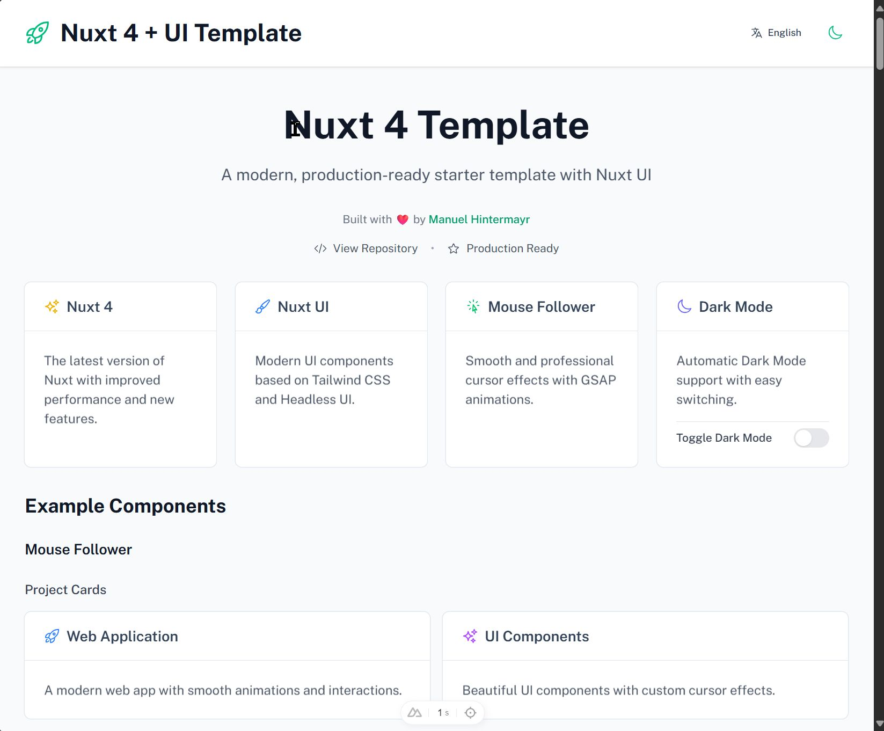

# Nuxt 4 Template – Swiss Style

A Nuxt 4 template with nuxt/ui (including Tailwind CSS) and i18n support in the Swiss Style (International Typographic Style). Modern, production-ready starter for web applications with a focus on clarity, grid, and internationalization.



**🌐 Live Demo:** [http://projects.manuelhintermayr.com/nuxt4-template-swiss-style](http://projects.manuelhintermayr.com/nuxt4-template-swiss-style)

**Developed by:** [Manuel Hintermayr](https://github.com/manuelhintermayr)  
**Repository:** [https://github.com/manuelhintermayr/nuxt4-template-swiss-style](https://github.com/manuelhintermayr/nuxt4-template-swiss-style)
_Based on [nuxt4-template](https://github.com/manuelhintermayr/nuxt4-template)_

## 🚀 Features

- ⚡️ **Nuxt 4** - Latest version with improved performance and new features
- 🎨 **Nuxt UI** - Modern UI components based on Tailwind CSS and Headless UI
- 🖼️ **Swiss Style** - Layout and design inspired by the International Typographic Style (Swiss Style)
- 🌍 **Internationalization** - Full i18n support with @nuxtjs/i18n
- 🌙 **Dark Mode** - Built-in dark/light mode toggle
- 📱 **Responsive Design** - Mobile-first approach
- 🔧 **TypeScript** - Full TypeScript support with type safety
- 🎯 **Component Architecture** - Modular, reusable Vue components
- 🎭 **Heroicons** - Beautiful SVG icons from the Heroicons library
- 🐭 **Mouse Follower** - Smooth mouse cursor effects with GSAP animations
- 🏗️ **Developer Experience** - Hot module replacement and fast refresh
- 🔍 **Code Quality Tools** - Automated unused variable detection and i18n management
- ⚙️ **VS Code Integration** - Pre-configured settings for optimal development experience


## 🛠️ Technology Stack

### Core Frameworks
- **[Nuxt 4](https://nuxt.com/)** - The Intuitive Vue Framework
- **[Vue 3](https://vuejs.org/)** - Progressive JavaScript Framework

### UI & Styling
- **[Nuxt UI](https://ui.nuxt.com/)** - Fully styled and customizable components
- **[Tailwind CSS](https://tailwindcss.com/)** - Utility-first CSS framework
- **Swiss Style Principles** - Grid-based layouts, clarity, and typographic hierarchy following the International Typographic Style
- **All UI components implemented based on [Nuxt UI Documentation](https://ui.nuxt.com/components/app)**

### Animation & Effects
- **[GSAP](https://greensock.com/gsap/)** - Professional-grade animation library
- **[ScrollTrigger](https://greensock.com/scrolltrigger/)** - Scroll-based animation trigger
- **[Mouse Follower](https://github.com/Cuberto/mouse-follower)** - Smooth mouse cursor effects

### Internationalization
- **[@nuxtjs/i18n](https://i18n.nuxtjs.org/)** - Internationalization module
- **Support for:** English (en) and German (de) out of the box
- **Lazy loading** - Translation files loaded on demand

### Icons & Assets
- **[@iconify-json/heroicons](https://iconify.design/)** - Heroicons icon collection
- **[@nuxt/icon](https://github.com/nuxt/icon)** - Icon component with 200k+ icons

### Development Tools
- **TypeScript** - Full type safety and IntelliSense
- **VS Code Integration** - Automatic code cleanup and unused import removal
- **Utility Scripts** - i18n management and code quality checks

## 📦 Installation

```bash
# Clone the repository
git clone https://github.com/manuelhintermayr/nuxt4-template-swiss-style.git
cd nuxt4-template-swiss-style

# Install dependencies
npm install
# or
pnpm install
# or
yarn install
# or
bun install
```

## 🚦 Development

Start the development server on `http://localhost:3000`:

```bash
npm run dev
# or
pnpm dev
# or
yarn dev
# or
bun run dev
```

### Additional Development Commands

```bash
# Code Quality Checks
npm run check:unused-vars          # Check for unused variables
npm run check:unused-vars-enhanced # Enhanced unused variable analysis
npm run lint:check                 # Run all code quality checks

# i18n Management  
npm run analyze:i18n              # Analyze i18n string usage
npm run cleanup:i18n              # Remove unused i18n strings

# Production Build
npm run build                     # Build for production
npm run preview                   # Preview production build
```

## 🏗️ Project Structure

```
nuxt4-template-swiss-style/
├── app/
│   ├── app.config.ts           # App configuration
│   ├── app.vue                 # Root application component
│   ├── assets/
│   │   └── css/               # Global styles and CSS files
│   ├── components/             # Reusable Vue components for showcase (including a language switcher)
│   ├── layouts/
│   │   └── default.vue         # Default layout template
│   ├── pages/
│   │   └── index.vue           # Main landing page
│   └── plugins/
│       ├── mouse-follower.client.ts # Mouse cursor effects initialization
│       └── gsap-animations.client.ts # GSAP animations and scroll effects
├── i18n/
│   ├── i18n.config.ts         # i18n configuration
│   └── locales/               # Translation files
│       ├── en.json            # English translations
│       └── de.json            # German translations
├── scripts/                   # Utility scripts for development and maintenance
│   ├── analyze-i18n-strings.js # Analyze i18n string usage across codebase
│   ├── cleanup-i18n-strings.js # Remove unused i18n strings automatically
│   ├── check-unused-vars.js    # Check for unused variables in all files
│   ├── check-unused-vars-enhanced.js # Enhanced unused variable analysis
│   └── README.md              # Documentation for utility scripts
├── public/                    # Static assets
├── nuxt.config.ts            # Nuxt configuration
├── package.json              # Dependencies and scripts
├── package-lock.json         # Lock file for dependencies
└── tsconfig.json             # TypeScript configuration
```

## 🎨 Component Architecture

### Modular Design
All UI elements are extracted into reusable components following Vue.js best practices:

- **Props-based components** - `FeatureCard.vue` accepts title, description, icon, and color props
- **Composable integration** - Uses Nuxt's auto-imported composables like `useI18n`
- **TypeScript interfaces** - Fully typed props and component APIs
- **Scoped styling** - Component-specific styles when needed

### Available Components

#### Layout Components
- `AppHeader` - Navigation header with logo, title, language switcher, and dark mode toggle
- `WelcomeSection` - Hero section with internationalized welcome message

## 🐭 Mouse Follower Integration

This template includes **Mouse Follower** by Cuberto, providing smooth and professional cursor effects.

### Features:
- **Pointer Detection** - Automatic cursor changes on interactive elements (buttons, links)
- **State Detection** - Custom cursor states for different element types
- **GSAP Integration** - Smooth animations powered by GreenSock
- **Performance Optimized** - Efficient animation loops and event handling

### Usage:
Add data attributes to elements for custom cursor behavior:

```html
<!-- Pointer cursor -->
<button data-cursor-pointer>Click me</button>

<!-- Text cursor -->
<p data-cursor-text>Selectable text</p>

<!-- Hidden cursor -->
<div data-cursor="-hidden">No cursor here</div>

<!-- Inverse cursor -->
<div data-cursor="-inverse">Inverted cursor</div>
```

The cursor automatically detects:
- `a, button` elements → pointer cursor
- Form inputs → text cursor
- Custom data attributes → specific states

## 🎭 GSAP Animations

This template includes a comprehensive **GSAP (GreenSock Animation Platform)** integration with advanced scroll-based animations and interactive effects.

## 🌍 Internationalization

### Supported Languages
- **English (en)** - Default language
- **German (de)** - Secondary language

### Language Persistence
The `LanguageSwitcher` component includes advanced locale management:

- **Default Behavior**: Always defaults to English on first visit
- **Persistence**: User's language choice is saved to localStorage
- **Restoration**: Automatically restores saved language preference on page reload
- **Type Safety**: Only accepts valid locale codes ('en', 'de')
- **Props Support**: Accepts `isBlack` prop for styling variations

### Translation Structure
```json
{
  "header": {
    "title": "Page title"
  },
  "welcome": {
    "title": "Welcome message",
    "subtitle": "Description"
  },
  "features": {
    "nuxt4": {
      "title": "Feature title",
      "description": "Feature description"
    }
  }
}
```

### Adding New Languages
1. Create a new JSON file in `i18n/locales/` (e.g., `fr.json`)
2. Add the locale configuration in `nuxt.config.ts`:
```typescript
locales: [
  { code: 'en', name: 'English', file: 'en.json' },
  { code: 'de', name: 'Deutsch', file: 'de.json' },
  { code: 'fr', name: 'Français', file: 'fr.json' }
]
```

### Maintenance Scripts
The template includes utility scripts for development and maintenance:

#### i18n Management:
- **`scripts/analyze-i18n-strings.js`** - Analyze string usage and identify unused translations
- **`scripts/cleanup-i18n-strings.js`** - Automatically remove unused strings from translation files

#### Code Quality:
- **`scripts/check-unused-vars.js`** - Check for unused variables across all TypeScript/Vue files
- **`scripts/check-unused-vars-enhanced.js`** - Enhanced analysis with import checking

See [`scripts/README.md`](scripts/README.md) for detailed usage instructions.

## 🏭 Production

Build the application for production:

```bash
npm run build
# or
pnpm build
# or
yarn build
# or
bun run build
```

Preview the production build locally:

```bash
npm run preview
# or
pnpm preview
# or
yarn preview
# or
bun run preview
```

## 📚 Documentation

- **[Nuxt 4 Documentation](https://nuxt.com/docs/getting-started/introduction)** - Learn about Nuxt features
- **[Nuxt UI Documentation](https://ui.nuxt.com/)** - UI component library
- **[Vue 3 Documentation](https://vuejs.org/guide/)** - Vue.js framework guide
- **[Tailwind CSS Documentation](https://tailwindcss.com/docs)** - Utility-first CSS
- **[GSAP Documentation](https://greensock.com/docs/)** - Animation library guide
- **[ScrollTrigger Documentation](https://greensock.com/docs/v3/Plugins/ScrollTrigger)** - Scroll animations
- **[Nuxt i18n Documentation](https://i18n.nuxtjs.org/)** - Internationalization guide
- **[TypeScript Documentation](https://www.typescriptlang.org/docs/)** - TypeScript handbook
- **[Mouse Follower Documentation](https://github.com/Cuberto/mouse-follower/blob/dev/README.MD)** - Smooth cursor effects library

## 🤝 Contributing

This template is designed to be a starting point for Nuxt 4 projects. Feel free to:

- Fork the repository
- Customize components and styling
- Add new features and integrations
- Submit pull requests for improvements
- Report issues and suggestions

## 📄 License

This project is open source and available under the [MIT License](LICENSE).

## 💝 Acknowledgments

- **Nuxt Team** for the amazing framework
- **Tailwind Labs** for Tailwind CSS and Headless UI
- **Heroicons** for the beautiful icon set
- **Vue.js Team** for the progressive framework
- **GreenSock** for the incredible [GSAP](https://greensock.com/) animation library
- **Cuberto** for the incredible [Mouse Follower](https://github.com/Cuberto/mouse-follower) library

---

**Happy coding!** 🚀

Built with ❤️ by [Manuel Hintermayr](https://github.com/manuelhintermayr)
